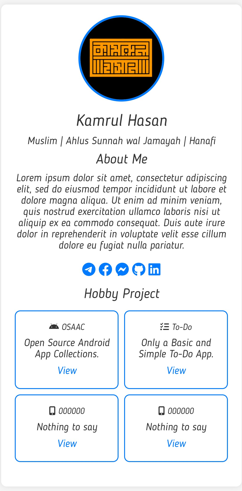

# Kamrul Hasan's Profile Card

This repository contains HTML and CSS code for a simple profile card displaying Kamrul Hasan's information.

## Preview

## About

It's just a straightforward personal profile card, nothing elaborate, just simple.

## Social Links

- [Personal Website](https://kamrulhasan.co)
- [Telegram](https://t.me/kamrulhasanofficial)
- [Facebook](https://fb.com/kamrulhasan.io)
- [LinkedIn](https://kamrulhasan.co)
- [GitHub](https://github.com/kamrulhasanio)

## How to Use

Simply open the `index.html` file in a web browser to view the profile card.

Feel free to fork this repository and customize it for your own use.

## License

This project is licensed under the MIT License - see the [LICENSE](LICENSE) file for details.
